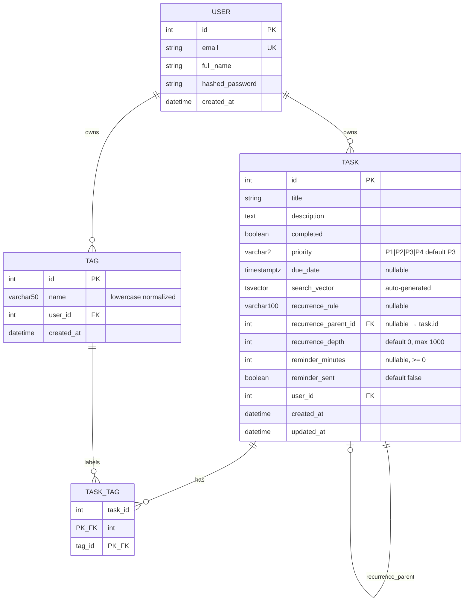

# Data Model: Phase V — Advanced Cloud Deployment

**Date**: 2026-02-07 | **Spec**: [spec.md](./spec.md)

---

## Entity Relationship Diagram

---

## Entities

### Task (Extended)

| Field | Type | Nullable | Default | Constraint | Migration |
| ----- | ---- | -------- | ------- | ---------- | --------- |
| id | SERIAL | No | auto | PK | existing |
| title | VARCHAR(255) | No | — | min 1 char | existing |
| description | TEXT | Yes | NULL | — | existing |
| completed | BOOLEAN | No | false | — | existing |
| priority | VARCHAR(2) | No | "P3" | CHECK IN (P1,P2,P3,P4) | 004 |
| due_date | TIMESTAMPTZ | Yes | NULL | — | 007 |
| search_vector | TSVECTOR | Yes | auto | GIN index, trigger | 006 |
| recurrence_rule | VARCHAR(100) | Yes | NULL | — | 008 |
| recurrence_parent_id | INTEGER | Yes | NULL | FK → task.id SET NULL | 008 |
| recurrence_depth | INTEGER | No | 0 | CHECK 0-1000 | 008 |
| reminder_minutes | INTEGER | Yes | NULL | CHECK >= 0 | 009 |
| reminder_sent | BOOLEAN | No | false | — | 009 |
| user_id | INTEGER | No | — | FK → user.id | existing |
| created_at | TIMESTAMPTZ | No | now() | — | existing |
| updated_at | TIMESTAMPTZ | No | now() | — | existing |

**Indexes**:
- `ix_task_user_id` (existing)
- `ix_task_search` GIN on `search_vector` (migration 006)
- `ix_task_due_date` on `due_date WHERE due_date IS NOT NULL` (migration 007)
- `ix_task_recurrence_parent` on `recurrence_parent_id WHERE NOT NULL` (migration 008)
- `ix_task_reminder_pending` on `due_date WHERE reminder_sent=false AND reminder_minutes IS NOT NULL AND completed=false` (migration 009)

**Validation Rules**:
- `priority`: must be one of P1, P2, P3, P4
- `due_date`: valid ISO 8601 datetime
- `recurrence_rule`: one of `daily`, `weekly`, `monthly`, or valid 5-field cron expression
- `recurrence_depth`: auto-incremented by Recurring Task Service; reject creation if parent depth >= 1000
- `reminder_minutes`: 0 to 10080 (7 days in minutes)

**State Transitions**:
- `completed: false → true` triggers `task.completed` event → may trigger recurring task creation
- `due_date` change resets `reminder_sent` to false
- `recurrence_rule` set to NULL stops future auto-creation

---

### Tag (New)

| Field | Type | Nullable | Default | Constraint |
| ----- | ---- | -------- | ------- | ---------- |
| id | SERIAL | No | auto | PK |
| name | VARCHAR(50) | No | — | UNIQUE(user_id, name) |
| user_id | INTEGER | No | — | FK → user.id CASCADE |
| created_at | TIMESTAMPTZ | No | now() | — |

**Indexes**:
- `ix_tag_user_name` UNIQUE on `(user_id, name)`
- `ix_tag_user_id` on `user_id`

**Validation Rules**:
- `name`: 1-50 characters, trimmed, lowercased
- Uniqueness per user enforced at DB level

---

### TaskTag Junction (New)

| Field | Type | Constraint |
| ----- | ---- | ---------- |
| task_id | INTEGER | FK → task.id CASCADE |
| tag_id | INTEGER | FK → tag.id CASCADE |

**Indexes**:
- Composite PK `(task_id, tag_id)`
- `ix_task_tag_tag_id` on `tag_id` for reverse lookups

**Validation Rules**:
- Max 10 tags per task (enforced in application layer)

---

### TaskEvent (Event Schema — not stored in DB)

| Field | Type | Description |
| ----- | ---- | ----------- |
| event_id | UUID4 string | Unique event identifier for idempotency |
| event_type | string | `task.created` / `task.updated` / `task.completed` / `task.deleted` |
| user_id | string | Owner of the task |
| task_id | integer | ID of the affected task |
| data | dict | Relevant fields (title, priority, tags, due_date, recurrence_rule) |
| schema_version | string | "1.0" |
| timestamp | ISO 8601 string | UTC event time |

---

### AuditLog (Consumed from Kafka — stored in DB)

| Field | Type | Nullable | Default | Constraint |
| ----- | ---- | -------- | ------- | ---------- |
| id | SERIAL | No | auto | PK |
| event_id | UUID | No | — | UNIQUE (idempotency) |
| event_type | VARCHAR(50) | No | — | — |
| user_id | VARCHAR(255) | No | — | indexed |
| task_id | INTEGER | No | — | — |
| data | JSONB | No | — | — |
| created_at | TIMESTAMPTZ | No | now() | — |

**Note**: AuditLog table created in a separate migration (010) by the Audit Logger consumer. Optional for V.1; required by V.2.
