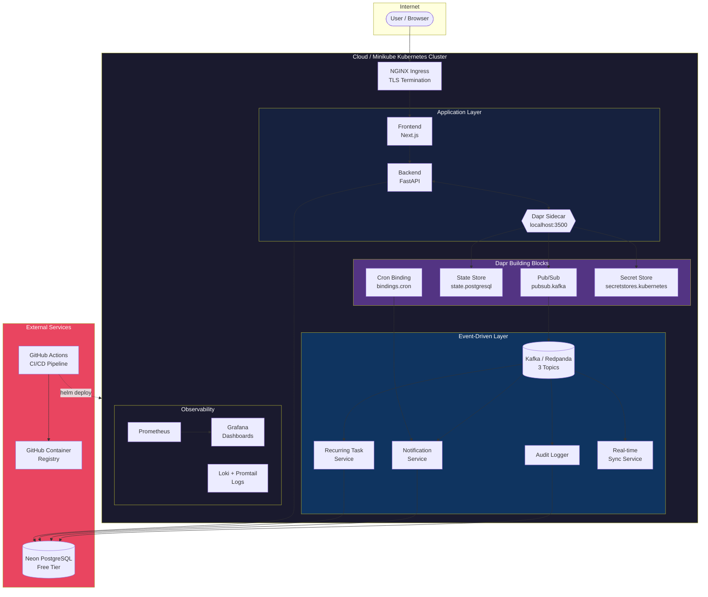

# Feature Specification: Phase V — Advanced Cloud Deployment

**Feature Branch**: `001-advanced-cloud-deployment`
**Created**: 2026-02-07
**Status**: Draft
**Owner**: Shumaila
**Input**: Phase V: Advanced Cloud Deployment — features, Kafka/Dapr event architecture, Minikube + Cloud K8s, CI/CD, monitoring

---

## 1. Objective

Transform the Todo AI Chatbot from a locally deployed application into a production-grade, event-driven distributed system. This phase adds intermediate features (priorities, tags, search/filter/sort), advanced features (due dates, recurring tasks, reminders), wires all state changes through Kafka events via Dapr sidecars, deploys to cloud Kubernetes (Oracle OKE primary), automates the pipeline with GitHub Actions CI/CD, and establishes monitoring with Prometheus, Grafana, and Loki.

---

## 2. Scope & Out-of-Scope

### In Scope

- **Part A — Features**: Priorities (P1-P4), tags (CRUD + filtering), full-text search, filter, sort with pagination, due dates (timezone-aware), recurring tasks (daily/weekly/monthly/cron), reminders with configurable lead times
- **Part A — Events**: Domain event emission after every CRUD commit; Kafka topics `task-events`, `reminders`, `task-updates`; consumer microservices for recurring tasks, notifications, audit logging, real-time sync
- **Part B — Dapr**: Pub/Sub (Kafka), State Management (PostgreSQL), Service Invocation, Bindings (cron for reminders), Secrets Management; all app code talks to `localhost:3500` only
- **Part B — Local Deployment**: Minikube with Dapr + Strimzi Kafka, Helm chart updates, `deploy-local.sh` and `teardown-local.sh` scripts
- **Part C — Cloud Deployment**: Oracle OKE always-free cluster, Redpanda Cloud Serverless Kafka, NGINX Ingress + TLS via cert-manager, HPA autoscaling
- **Part C — CI/CD**: GitHub Actions pipeline (lint, test, build, push to GHCR, deploy via Helm), one-click rollback
- **Part C — Monitoring**: Prometheus + Grafana dashboards (as ConfigMaps) + Loki logging + Dapr-native tracing

### Out of Scope

- Real-time collaboration / multi-user shared tasks
- Mobile native application
- Custom notification channels beyond in-app (no SMS, email, push)
- Multi-tenancy admin dashboard
- Data export / import functionality
- AI model fine-tuning or custom LLM hosting
- Payment / billing features

---

## 3. User Scenarios & Testing

### User Story 1 — Organize Tasks with Priorities and Tags (Priority: P1)

A user wants to assign priority levels and tags to tasks so they can focus on what matters most and categorize their work.

**Why this priority**: Priority and tag support are the foundation for all subsequent filtering, sorting, and search features. Without them, advanced features have no data to operate on.

**Independent Test**: Create a task with priority "P1" and tags "work, urgent" via the chatbot. Verify the task is stored with correct attributes and appears when filtered by priority or tag.

**Acceptance Scenarios**:

1. **Given** a user creates a task, **When** they specify priority "High", **Then** the task is saved with priority level P2 (High) and the chatbot confirms the priority
2. **Given** a user creates a task with tags "groceries, personal", **When** they list tasks filtered by tag "groceries", **Then** only tasks with that tag appear
3. **Given** a user updates a task's priority from Low to Critical, **When** the update succeeds, **Then** a `task.updated` domain event is emitted with the new priority

---

### User Story 2 — Search, Filter, and Sort Tasks (Priority: P1)

A user wants to search across their tasks by keyword, filter by status/priority/tag/due date, and sort results by different criteria.

**Why this priority**: Search and filtering make the chatbot genuinely useful for users with many tasks. This is a core usability feature.

**Independent Test**: Create 10+ tasks with varying priorities, tags, and statuses. Search for a keyword, filter by priority "High", sort by due date. Verify correct results with pagination.

**Acceptance Scenarios**:

1. **Given** a user has 25 tasks, **When** they search "meeting", **Then** only tasks containing "meeting" in title or description are returned, paginated (10 per page default)
2. **Given** a user filters by `priority=P1` and `completed=false`, **When** results are returned, **Then** only incomplete critical tasks appear, sorted by creation date descending
3. **Given** a user sorts tasks by due date ascending, **When** some tasks have no due date, **Then** tasks without due dates appear last

---

### User Story 3 — Set Due Dates and Get Reminders (Priority: P2)

A user wants to assign due dates to tasks and receive reminders before deadlines so they never miss important tasks.

**Why this priority**: Due dates and reminders drive the event-driven architecture (Kafka events, cron bindings, consumer services) — they are the primary use case for the entire event pipeline.

**Independent Test**: Create a task with a due date 1 hour from now and a 30-minute reminder. Verify the reminder fires at the correct time and the user is notified exactly once.

**Acceptance Scenarios**:

1. **Given** a user creates a task with `due_date="2026-02-10"` and `reminder_minutes=60`, **When** the current time is 60 minutes before the due date, **Then** a reminder notification is triggered
2. **Given** a reminder has already been sent for a task, **When** the reminder cron runs again, **Then** no duplicate reminder is sent (`reminder_sent` flag is checked)
3. **Given** a user sets a due date in a different timezone, **When** the task is stored, **Then** the due date is converted to UTC and the reminder fires at the correct local time

---

### User Story 4 — Create Recurring Tasks (Priority: P2)

A user wants tasks that automatically recreate themselves on a schedule (daily standup, weekly report, monthly review).

**Why this priority**: Recurring tasks demonstrate the full event pipeline: task completion triggers an event, the recurring task consumer creates the next occurrence, and another event logs the creation.

**Independent Test**: Create a recurring task with interval "weekly". Complete it. Verify a new task is auto-created with the next due date (7 days later) and the original is marked complete.

**Acceptance Scenarios**:

1. **Given** a user creates a recurring task with `recurrence_rule="weekly"`, **When** they complete the task, **Then** a `task.completed` event triggers the Recurring Task Service to create the next occurrence with `due_date` advanced by 7 days
2. **Given** a recurring task has been auto-created, **When** the system checks recurrence depth, **Then** the `recurrence_parent_id` chain depth is validated to be under 1000
3. **Given** a user deletes a recurring task, **When** deletion succeeds, **Then** no further occurrences are auto-created

---

### User Story 5 — Deploy and Access the App on Cloud Kubernetes (Priority: P3)

A developer (Shumaila) wants to deploy the full stack to Oracle OKE with a single Helm command and access it via a public URL with TLS.

**Why this priority**: Cloud deployment is the culmination of all previous work — features, events, and Dapr must all work before cloud deployment makes sense.

**Independent Test**: Run `helm upgrade --install -f values-cloud.yaml` against the OKE cluster. Verify all pods are Running with 2/2 containers, the public URL returns 200 with valid TLS, and a task created via the chatbot triggers events visible in the monitoring dashboard.

**Acceptance Scenarios**:

1. **Given** the OKE cluster is provisioned, **When** `helm upgrade --install -f values-cloud.yaml` is run, **Then** all services deploy within 10 minutes and enter Running state
2. **Given** the app is deployed, **When** a user creates a task via the public URL, **Then** a `task.created` event appears in the Kafka topic within 5 seconds
3. **Given** a failed deployment, **When** Helm's `--atomic` flag detects the failure, **Then** the deployment auto-rolls back to the previous healthy version

---

### User Story 6 — Automated CI/CD Pipeline (Priority: P3)

A developer pushes code to `main` and the entire pipeline — lint, test, build, push, deploy — runs automatically, with one-click rollback available.

**Why this priority**: CI/CD is an operational concern that becomes valuable after features and infrastructure are stable.

**Independent Test**: Push a commit to `main`. Verify the GitHub Actions pipeline completes in under 15 minutes. Then trigger a rollback via `workflow_dispatch` and verify the previous version is restored.

**Acceptance Scenarios**:

1. **Given** a push to `main`, **When** the pipeline runs, **Then** lint + test + build + push + deploy complete in under 15 minutes
2. **Given** tests fail in the pipeline, **When** the test stage reports failure, **Then** build and deploy stages are skipped
3. **Given** a bad deployment, **When** a developer triggers rollback via `workflow_dispatch`, **Then** the previous Helm revision is restored within 3 minutes

---

### User Story 7 — Monitor System Health (Priority: P3)

A developer wants dashboards showing system metrics, Kafka consumer lag, error rates, and searchable logs so they can troubleshoot issues quickly.

**Why this priority**: Monitoring is the last layer — needed for production confidence but not for core functionality.

**Independent Test**: Deploy the monitoring stack. Trigger an intentional error. Verify the alert fires in Grafana and the error is searchable in Loki within 30 seconds.

**Acceptance Scenarios**:

1. **Given** the monitoring stack is deployed, **When** a pod restarts more than 3 times in 5 minutes, **Then** a `PodRestartsTooHigh` alert fires
2. **Given** Grafana is running, **When** a developer opens the "Todo Chatbot" dashboard folder, **Then** all dashboards (API metrics, Kafka lag, pod resources) are pre-loaded
3. **Given** a request fails, **When** a developer searches Loki by correlation ID, **Then** the full request trace appears within 30 seconds of the event

---

### Edge Cases

- What happens when a user creates a task with an invalid recurrence rule (e.g., "every purple")?
  - System rejects with a clear error message; only `daily`, `weekly`, `monthly`, and valid cron expressions are accepted
- What happens when Kafka is unavailable during event publishing?
  - The CRUD operation succeeds (event emission is fire-and-forget with retry); failed events are logged and retried up to 3 times with exponential backoff
- What happens when a recurring task chain reaches depth 1000?
  - The system stops auto-creating new occurrences and logs a warning; the user is notified via the chatbot
- What happens when two reminders are scheduled for the same task at the same time?
  - Idempotent consumer with `event_id` tracking ensures only one reminder is sent; `reminder_sent` flag prevents re-triggering
- What happens when a user deletes their account?
  - All user tasks, tags, recurrence rules, and pending reminders are cascade-deleted; orphaned events are consumed and discarded by checking user existence
- What happens when the Dapr sidecar is not injected (misconfigured annotations)?
  - Health check at `/v1.0/healthz` fails; pod reports not-ready; `USE_DAPR=false` fallback allows direct Kafka access for debugging

---

## 4. Architecture Overview



### Key Architectural Decisions

- **Dapr sidecars**: All inter-service communication and event publishing goes through Dapr HTTP API (`localhost:3500`). This decouples app code from infrastructure — swapping Kafka for Redis requires only a YAML change.
- **Kafka via Redpanda**: Redpanda Cloud Serverless (free tier, Kafka-compatible, no Zookeeper) for cloud; Strimzi operator for self-hosted Minikube.
- **Oracle OKE primary**: Always-free tier with 4 OCPUs and 24GB RAM — no time-limited credits.
- **Events after commit**: Domain events are published ONLY after the database transaction commits successfully, preventing phantom events.
- **Dual transport toggle**: `USE_DAPR=true/false` environment variable switches between Dapr HTTP and direct aiokafka — fallback for when Dapr is unavailable.

---

## 5. Part A — Advanced & Intermediate Features

### 5.0 Current Baseline (Phase III State)

The existing `task` table and MCP tools serve as the starting point. Understanding what already exists prevents duplicate work.

**Current `task` table columns:**

| Column | Type | Nullable | Default | Notes |
| ------ | ---- | -------- | ------- | ----- |
| `id` | INTEGER | No | auto-increment | Primary key |
| `title` | VARCHAR | No | — | min_length=1 |
| `description` | TEXT | Yes | NULL | — |
| `completed` | BOOLEAN | No | false | — |
| `priority` | VARCHAR | No | "Medium" | Currently free-text ("Low"/"Medium"/"High") |
| `due_date` | VARCHAR | Yes | NULL | Currently stored as string, not datetime |
| `user_id` | INTEGER | No | — | FK → user.id |
| `created_at` | DATETIME | No | utcnow | — |
| `updated_at` | DATETIME | No | utcnow | — |

**Current MCP tool parameters:**

| Tool | Accepts | Notes |
| ---- | ------- | ----- |
| `add_task` | title, description, priority (Low/Medium/High), due_date (YYYY-MM-DD string) | No tags, no recurrence, no reminder |
| `update_task` | title, description, priority, due_date, completed | Same gaps |
| `list_tasks` | user_id only | No search, filter, sort, or pagination |
| `complete_task` | task_id, user_id | No event emission |
| `delete_task` | task_id, user_id | No event emission |

---

### 5.1 Intermediate Features

#### 5.1.1 Priorities (Upgrade from Phase III)

Phase III already has a `priority` column with free-text values ("Low", "Medium", "High"). Phase V upgrades this to a formal 4-level enum.

**Behavior:**
- Four levels: **P1** (Critical), **P2** (High), **P3** (Medium), **P4** (Low)
- Default: P3 (Medium) when not specified
- Backward compatibility: existing "Low"/"Medium"/"High" values are migrated to P4/P3/P2

**DB Schema Change (Alembic migration 004):**

| Action | Column | Type | Nullable | Default | Constraint |
| ------ | ------ | ---- | -------- | ------- | ---------- |
| ALTER | `priority` | VARCHAR(2) | No | "P3" | CHECK IN ('P1','P2','P3','P4') |

```sql
-- Migration: convert existing values
UPDATE task SET priority = CASE
    WHEN priority = 'High'   THEN 'P2'
    WHEN priority = 'Medium' THEN 'P3'
    WHEN priority = 'Low'    THEN 'P4'
    ELSE 'P3'
END;

-- Add check constraint
ALTER TABLE task ADD CONSTRAINT ck_task_priority
    CHECK (priority IN ('P1', 'P2', 'P3', 'P4'));
```

**Downgrade:** reverse the CASE mapping (P1→"High", P2→"High", P3→"Medium", P4→"Low"); drop constraint.

**MCP Tool Changes:**
- `add_task`: `priority` parameter accepts "P1"/"P2"/"P3"/"P4" (replaces "Low"/"Medium"/"High")
- `update_task`: same change
- `list_tasks`: new `priority` filter parameter

**Validation:** reject any value not in `{P1, P2, P3, P4}` with error code `invalid_priority`

**UI Impact:** Priority badge with color coding (P1=red, P2=orange, P3=blue, P4=gray); filter dropdown; sort option

**Event:** `task.created` and `task.updated` events include `priority` field

---

#### 5.1.2 Tags (New Entity)

**Behavior:**
- Free-form text tags, many-to-many relationship with tasks
- Maximum 10 tags per task; tag name max 50 characters, lowercase-normalized, trimmed
- Tags are per-user (user A's "work" tag is independent of user B's "work" tag)
- Duplicate tag names per user are prevented (unique constraint)

**DB Schema Change (Alembic migration 005):**

**New `tag` table:**

| Column | Type | Nullable | Default | Constraint |
| ------ | ---- | -------- | ------- | ---------- |
| `id` | INTEGER | No | auto-increment | Primary key |
| `name` | VARCHAR(50) | No | — | Lowercase normalized |
| `user_id` | INTEGER | No | — | FK → user.id, ON DELETE CASCADE |
| `created_at` | DATETIME | No | utcnow | — |

**Indexes:** `UNIQUE(user_id, name)` — prevents duplicate tags per user
**Index:** `ix_tag_user_id` on `user_id` for fast lookups

**New `task_tag` junction table:**

| Column | Type | Nullable | Constraint |
| ------ | ---- | -------- | ---------- |
| `task_id` | INTEGER | No | FK → task.id, ON DELETE CASCADE |
| `tag_id` | INTEGER | No | FK → tag.id, ON DELETE CASCADE |

**Indexes:** `PRIMARY KEY(task_id, tag_id)` — composite PK prevents duplicate associations
**Index:** `ix_task_tag_tag_id` on `tag_id` for reverse lookups

```sql
-- Migration 005
CREATE TABLE tag (
    id SERIAL PRIMARY KEY,
    name VARCHAR(50) NOT NULL,
    user_id INTEGER NOT NULL REFERENCES "user"(id) ON DELETE CASCADE,
    created_at TIMESTAMP NOT NULL DEFAULT now()
);
CREATE UNIQUE INDEX ix_tag_user_name ON tag(user_id, name);

CREATE TABLE task_tag (
    task_id INTEGER NOT NULL REFERENCES task(id) ON DELETE CASCADE,
    tag_id INTEGER NOT NULL REFERENCES tag(id) ON DELETE CASCADE,
    PRIMARY KEY (task_id, tag_id)
);
```

**Downgrade:** `DROP TABLE task_tag; DROP TABLE tag;`

**MCP Tool Changes:**
- `add_task`: new optional `tags` parameter (array of strings, max 10). Tags are auto-created if they don't exist for the user.
- `update_task`: new optional `tags` parameter (replaces all tags on the task)
- `list_tasks`: new optional `tag` filter parameter (string, filters tasks having that tag)
- New tool `list_tags`: returns all tags for the user with task counts

**Validation:**
- Tag name: 1-50 characters, stripped, lowercased; reject empty or whitespace-only
- Max 10 tags per task; reject with error code `too_many_tags` if exceeded
- Tag name uniqueness enforced per-user at DB level

**UI Impact:** Tag chips on task cards; tag filter sidebar; tag auto-complete in chat input

**Event:** `task.created` and `task.updated` events include `tags` array in event data

---

#### 5.1.3 Search

**Behavior:**
- Full-text search across task `title` and `description`
- Case-insensitive, supports partial word matching
- Only searches within the authenticated user's tasks

**DB Schema Change (Alembic migration 006):**

| Action | Target | Type | Notes |
| ------ | ------ | ---- | ----- |
| ADD COLUMN | `search_vector` | TSVECTOR | Generated from title + description |
| CREATE INDEX | `ix_task_search` | GIN | On `search_vector` for fast full-text search |
| CREATE TRIGGER | `task_search_update` | — | Auto-updates `search_vector` on INSERT/UPDATE |

```sql
-- Migration 006
ALTER TABLE task ADD COLUMN search_vector TSVECTOR;

UPDATE task SET search_vector =
    to_tsvector('english', coalesce(title, '') || ' ' || coalesce(description, ''));

CREATE INDEX ix_task_search ON task USING GIN(search_vector);

CREATE TRIGGER task_search_update
    BEFORE INSERT OR UPDATE OF title, description ON task
    FOR EACH ROW EXECUTE FUNCTION
    tsvector_update_trigger(search_vector, 'pg_catalog.english', title, description);
```

**Downgrade:** `DROP TRIGGER task_search_update; DROP INDEX ix_task_search; ALTER TABLE task DROP COLUMN search_vector;`

**MCP Tool Changes:**
- `list_tasks`: new optional `search` parameter (string). Searches using `plainto_tsquery` for safety (no SQL injection via raw tsquery syntax).

**Validation:** Search query max 200 characters; empty string returns all tasks (no filter applied)

**UI Impact:** Search bar in task list header; matching terms highlighted in results

---

#### 5.1.4 Filter

**Behavior:**
- Filter tasks by any combination of: `completed` (bool), `priority` (P1-P4), `tag` (string), `due_before` (date), `due_after` (date), `has_reminder` (bool), `is_overdue` (bool)
- Multiple filters combine with AND logic
- Only applied within the authenticated user's tasks

**DB Schema Change:** None — filtering is query composition in the CRUD layer. Existing columns + tag join + due_date comparison are sufficient.

**MCP Tool Changes:**
- `list_tasks` gains these optional parameters:

| Parameter | Type | Description |
| --------- | ---- | ----------- |
| `completed` | bool | Filter by completion status |
| `priority` | string | Filter by priority level (P1-P4) |
| `tag` | string | Filter by tag name (exact match, lowercase) |
| `due_before` | string (YYYY-MM-DD) | Tasks due before this date |
| `due_after` | string (YYYY-MM-DD) | Tasks due after this date |
| `has_reminder` | bool | Tasks with active reminders |
| `is_overdue` | bool | Tasks past due date and not completed |

**Validation:** Date parameters validated as YYYY-MM-DD; `due_before` must be >= `due_after` if both provided; priority validated against P1-P4 enum

**UI Impact:** Filter panel with dropdowns and toggles; active filter count badge

---

#### 5.1.5 Sort & Pagination

**Behavior:**
- Sort by: `created_at`, `updated_at`, `due_date`, `priority`, `title`
- Sort order: `asc` or `desc` (default: `created_at desc`)
- Priority sort order: P1 > P2 > P3 > P4 (ascending = most critical first)
- Tasks with NULL `due_date` appear last when sorting by due date
- Pagination: offset-based with `page` and `page_size` parameters

**DB Schema Change:** None — sorting and pagination are query modifiers.

**MCP Tool Changes:**
- `list_tasks` gains these optional parameters:

| Parameter | Type | Default | Description |
| --------- | ---- | ------- | ----------- |
| `sort_by` | string | "created_at" | Column to sort by |
| `sort_order` | string | "desc" | "asc" or "desc" |
| `page` | integer | 1 | Page number (1-indexed) |
| `page_size` | integer | 10 | Results per page (1-100) |

- Response includes: `total_count`, `page`, `page_size`, `total_pages` alongside the task list

**Validation:**
- `sort_by` must be one of: `created_at`, `updated_at`, `due_date`, `priority`, `title`
- `sort_order` must be `asc` or `desc`
- `page` must be >= 1; `page_size` must be 1-100

**UI Impact:** Sort dropdown in task list header; page navigation controls

---

### 5.2 Advanced Features

#### 5.2.1 Due Dates (Upgrade from Phase III)

Phase III already has `due_date` as an optional VARCHAR string. Phase V upgrades to proper TIMESTAMP WITH TIME ZONE for correct UTC handling and range queries.

**Behavior:**
- ISO 8601 datetime format, stored as UTC in the database
- Optional timezone parameter for display conversion (frontend concern)
- Overdue detection: tasks with `due_date < now()` and `completed = false` are flagged

**DB Schema Change (Alembic migration 007):**

| Action | Column | Old Type | New Type | Notes |
| ------ | ------ | -------- | -------- | ----- |
| ALTER | `due_date` | VARCHAR | TIMESTAMP WITH TIME ZONE | Nullable, existing strings converted |

```sql
-- Migration 007: convert due_date from VARCHAR to TIMESTAMPTZ
ALTER TABLE task
    ALTER COLUMN due_date TYPE TIMESTAMP WITH TIME ZONE
    USING CASE
        WHEN due_date IS NOT NULL AND due_date ~ '^\d{4}-\d{2}-\d{2}$'
        THEN (due_date || 'T00:00:00Z')::TIMESTAMPTZ
        ELSE NULL
    END;

-- Index for range queries
CREATE INDEX ix_task_due_date ON task(due_date) WHERE due_date IS NOT NULL;
```

**Downgrade:** `ALTER TABLE task ALTER COLUMN due_date TYPE VARCHAR USING to_char(due_date, 'YYYY-MM-DD'); DROP INDEX ix_task_due_date;`

**MCP Tool Changes:**
- `add_task` and `update_task`: `due_date` parameter now accepts ISO 8601 datetime strings (e.g., "2026-02-10T14:00:00Z" or "2026-02-10")
- `list_tasks`: new `due_before`/`due_after` filter parameters (covered in 5.1.4)
- Response includes `is_overdue: bool` computed field

**Validation:** Must be valid ISO 8601; dates in the past are allowed (for backdating) but emit a warning in the chatbot response

**Event:** `task.created` and `task.updated` events include `due_date` as ISO 8601 UTC string

---

#### 5.2.2 Recurring Tasks (New Feature)

**Behavior:**
- Supported recurrence rules: `daily`, `weekly`, `monthly`, or a valid cron expression (e.g., `0 9 * * 1-5` for weekdays at 9am)
- When a recurring task is **completed**, a `task.completed` event triggers the **Recurring Task Service** consumer to create the next occurrence
- The new task inherits: title, description, priority, tags, recurrence_rule, reminder_minutes
- The new task's `due_date` is advanced by the recurrence interval from the **current** due_date (not from now)
- If the parent has no `due_date`, the next occurrence's due_date is calculated from `now()` + interval
- Chain depth tracked via `recurrence_parent_id` → maximum 1000 to prevent infinite loops
- Deleting a recurring task stops the chain — no further occurrences are created

**DB Schema Change (Alembic migration 008):**

| Action | Column | Type | Nullable | Default | Constraint |
| ------ | ------ | ---- | -------- | ------- | ---------- |
| ADD | `recurrence_rule` | VARCHAR(100) | Yes | NULL | — |
| ADD | `recurrence_parent_id` | INTEGER | Yes | NULL | FK → task.id, ON DELETE SET NULL |
| ADD | `recurrence_depth` | INTEGER | No | 0 | CHECK >= 0 AND <= 1000 |

```sql
-- Migration 008
ALTER TABLE task ADD COLUMN recurrence_rule VARCHAR(100);
ALTER TABLE task ADD COLUMN recurrence_parent_id INTEGER
    REFERENCES task(id) ON DELETE SET NULL;
ALTER TABLE task ADD COLUMN recurrence_depth INTEGER NOT NULL DEFAULT 0;

ALTER TABLE task ADD CONSTRAINT ck_task_recurrence_depth
    CHECK (recurrence_depth >= 0 AND recurrence_depth <= 1000);

CREATE INDEX ix_task_recurrence_parent ON task(recurrence_parent_id)
    WHERE recurrence_parent_id IS NOT NULL;
```

**Downgrade:** Drop constraint, drop index, drop columns.

**Recurrence Rule Validation:**
- `daily` → +1 day
- `weekly` → +7 days
- `monthly` → +1 month (calendar-aware: Jan 31 → Feb 28)
- Cron expression → validated with standard 5-field cron parser; next occurrence computed from cron schedule
- Any other string → rejected with error code `invalid_recurrence_rule`

**MCP Tool Changes:**
- `add_task`: new optional `recurrence_rule` parameter (string)
- `update_task`: can modify `recurrence_rule` (set to null to stop recurrence)
- New tool `list_recurring_tasks`: returns only tasks with `recurrence_rule IS NOT NULL` for the user

**Event Chain:**

```
User completes task (recurrence_rule="weekly", due_date="2026-02-10")
    → DB commit
    → Emit task.completed event to task-events topic
    → Recurring Task Service consumes event
    → Checks: recurrence_rule is set? depth < 1000?
    → Creates new task: due_date="2026-02-17", recurrence_depth=parent.depth+1
    → DB commit
    → Emit task.created event
```

**Safety Guards:**
- `recurrence_depth` >= 1000 → log warning, do NOT create next occurrence, notify user
- `recurrence_parent_id` ON DELETE SET NULL → deleting parent does not cascade-delete children, but breaks the chain

---

#### 5.2.3 Reminders (New Feature)

**Behavior:**
- Users set a reminder lead time in minutes (default: 60 minutes before due date)
- A Dapr cron binding runs every minute, triggering the backend to check for due reminders
- The backend queries: `WHERE due_date - interval '{reminder_minutes} minutes' <= now() AND reminder_sent = false AND completed = false`
- Matching tasks are published to the `reminders` topic
- The **Notification Service** consumer sends the reminder and sets `reminder_sent = true`
- Each reminder is sent **exactly once** per task (idempotent via `reminder_sent` flag + `event_id` tracking)

**DB Schema Change (Alembic migration 009):**

| Action | Column | Type | Nullable | Default | Notes |
| ------ | ------ | ---- | -------- | ------- | ----- |
| ADD | `reminder_minutes` | INTEGER | Yes | NULL | NULL = no reminder; 0 = at due time |
| ADD | `reminder_sent` | BOOLEAN | No | false | Reset to false if due_date changes |

```sql
-- Migration 009
ALTER TABLE task ADD COLUMN reminder_minutes INTEGER;
ALTER TABLE task ADD COLUMN reminder_sent BOOLEAN NOT NULL DEFAULT false;

ALTER TABLE task ADD CONSTRAINT ck_task_reminder_minutes
    CHECK (reminder_minutes IS NULL OR reminder_minutes >= 0);

-- Index for the reminder cron query
CREATE INDEX ix_task_reminder_pending ON task(due_date)
    WHERE reminder_sent = false
    AND reminder_minutes IS NOT NULL
    AND completed = false;
```

**Downgrade:** Drop constraint, drop index, drop columns.

**MCP Tool Changes:**
- `add_task`: new optional `reminder_minutes` parameter (integer, >= 0)
- `update_task`: can modify `reminder_minutes`; updating `due_date` automatically resets `reminder_sent` to false

**Validation:**
- `reminder_minutes` must be >= 0 if provided; NULL means no reminder
- Setting `reminder_minutes` without `due_date` returns warning: "Reminder set but no due date — reminder won't fire until a due date is added"
- Max value: 10080 (7 days in minutes)

**Event Flow:**

```
Dapr cron binding fires every 1 minute
    → Backend /api/internal/check-reminders endpoint
    → Query: tasks WHERE due_date - reminder_minutes <= now()
             AND reminder_sent = false AND completed = false
    → For each match: publish ReminderEvent to reminders topic
    → Notification Service consumes event
    → Checks event_id for idempotency (skip if already processed)
    → Sends notification to user
    → Sets reminder_sent = true via DB update
```

**Edge Cases:**
- Task completed before reminder fires → reminder is skipped (query includes `completed = false`)
- Due date changed after reminder sent → `reminder_sent` reset to false, new reminder will fire
- Multiple reminders on same task from race condition → `event_id` idempotency check in consumer prevents duplicates

---

### 5.3 Complete DB Schema After All Migrations

**Final `task` table (after migrations 004-009):**

| Column | Type | Nullable | Default | Constraint | Migration |
| ------ | ---- | -------- | ------- | ---------- | --------- |
| `id` | SERIAL | No | auto | PK | existing |
| `title` | VARCHAR | No | — | min 1 char | existing |
| `description` | TEXT | Yes | NULL | — | existing |
| `completed` | BOOLEAN | No | false | — | existing |
| `priority` | VARCHAR(2) | No | "P3" | CHECK P1-P4 | 004 |
| `due_date` | TIMESTAMPTZ | Yes | NULL | — | 007 |
| `user_id` | INTEGER | No | — | FK → user.id | existing |
| `created_at` | TIMESTAMPTZ | No | now() | — | existing |
| `updated_at` | TIMESTAMPTZ | No | now() | — | existing |
| `search_vector` | TSVECTOR | Yes | auto-trigger | GIN index | 006 |
| `recurrence_rule` | VARCHAR(100) | Yes | NULL | — | 008 |
| `recurrence_parent_id` | INTEGER | Yes | NULL | FK → task.id, SET NULL | 008 |
| `recurrence_depth` | INTEGER | No | 0 | CHECK 0-1000 | 008 |
| `reminder_minutes` | INTEGER | Yes | NULL | CHECK >= 0 | 009 |
| `reminder_sent` | BOOLEAN | No | false | — | 009 |

**New `tag` table (migration 005):**

| Column | Type | Nullable | Default | Constraint |
| ------ | ---- | -------- | ------- | ---------- |
| `id` | SERIAL | No | auto | PK |
| `name` | VARCHAR(50) | No | — | UNIQUE(user_id, name) |
| `user_id` | INTEGER | No | — | FK → user.id, CASCADE |
| `created_at` | TIMESTAMPTZ | No | now() | — |

**New `task_tag` junction table (migration 005):**

| Column | Type | Constraint |
| ------ | ---- | ---------- |
| `task_id` | INTEGER | FK → task.id, CASCADE |
| `tag_id` | INTEGER | FK → tag.id, CASCADE |
| — | — | PK(task_id, tag_id) |

**Migration Execution Order:** 004 (priority enum) → 005 (tags) → 006 (search vector) → 007 (due_date type) → 008 (recurrence) → 009 (reminders)

---

## 6. Part B — Event-Driven Architecture & Dapr

### Kafka Topics & Schemas

| Topic | Retention | Partition Key | Purpose |
| ----- | --------- | ------------- | ------- |
| `task-events` | 7 days | `user_id` | All CRUD lifecycle events |
| `reminders` | 1 day | `user_id` | Scheduled reminder triggers |
| `task-updates` | 1 hour | `user_id` | Real-time sync to frontends |

### Event Schema (TaskEvent)

```python
@dataclass
class TaskEvent:
    event_id: str         # UUID4
    event_type: str       # task.created | task.updated | task.completed | task.deleted
    user_id: str
    task_id: int
    data: dict            # Relevant fields (title, priority, tags, due_date, etc.)
    schema_version: str   # "1.0"
    timestamp: str        # ISO 8601 UTC
```

### Consumer Services

| Service | Subscribes To | Action |
| ------- | ------------- | ------ |
| Recurring Task Service | `task-events` (task.completed) | Create next occurrence if `recurrence_rule` set |
| Notification Service | `reminders` | Send reminder to user, set `reminder_sent=true` |
| Audit Logger | `task-events` (all) | Write audit log entry per user |
| Real-time Sync | `task-updates` | Push updates to connected frontends |

### Dapr Building Blocks

| Block | Component YAML | Purpose |
| ----- | -------------- | ------- |
| Pub/Sub | `pubsub.kafka` | Publish/subscribe to Kafka topics |
| State | `state.postgresql` | Conversation state storage |
| Service Invocation | (built-in) | Frontend → Backend with retries + mTLS |
| Bindings | `bindings.cron` | Check for due reminders every minute |
| Secrets | `secretstores.kubernetes` | API keys, DB URL, Kafka credentials |

### Dapr Component Example

```yaml
apiVersion: dapr.io/v1alpha1
kind: Component
metadata:
  name: task-pubsub
  namespace: todo-app
spec:
  type: pubsub.kafka
  version: v1
  metadata:
    - name: brokers
      secretKeyRef:
        name: kafka-secrets
        key: brokers
    - name: authType
      value: "password"
    - name: saslUsername
      secretKeyRef:
        name: kafka-secrets
        key: username
    - name: saslPassword
      secretKeyRef:
        name: kafka-secrets
        key: password
```

### Sidecar Rules

- Application code calls `http://localhost:3500/v1.0/publish/task-pubsub/task-events` — never Kafka directly
- Swapping `pubsub.kafka` to `pubsub.redis` requires zero code changes
- All secrets retrieved via `GET /v1.0/secrets/{store}/{name}` with env-var fallback
- Health check: `GET /v1.0/healthz` must pass before pod accepts traffic

---

## 7. Part C — Deployment Targets

### 7.1 Local (Minikube)

- Minikube v1.38.0+ with Docker driver, 6GB memory, 3 CPUs
- `dapr init -k --runtime-version 1.13.0` on the cluster
- Strimzi Kafka operator: 1 broker, ephemeral storage, 1.5Gi memory limit
- Topics auto-created: `task-events`, `reminders`, `task-updates`
- Local images built with `eval $(minikube docker-env)`, `imagePullPolicy: IfNotPresent`
- Helm install: `helm upgrade --install todo-app charts/todo-app -f values-local.yaml --atomic`
- Startup script: `deploy-local.sh` (staged orchestration with health checks between stages)
- Teardown script: `teardown-local.sh` (reverse order cleanup)
- Total memory budget: < 8GB

### 7.2 Cloud (Oracle OKE Primary)

- Oracle OKE always-free: 4 OCPUs, 24GB RAM, 2 worker nodes
- Fallback: Azure AKS ($200/30d free credits) or Google GKE ($300/90d free credits)
- Kafka: Redpanda Cloud Serverless (free tier, Kafka-compatible, SASL authentication)
- NGINX Ingress Controller with LoadBalancer service
- TLS: cert-manager with Let's Encrypt or Oracle Cloud certificates
- Images hosted on GitHub Container Registry (GHCR), tagged with git SHA
- Helm values: `values-cloud.yaml` with cloud-specific overrides (image registry, resource limits, HPA)
- HPA: min 1, max 3 replicas, target 70% CPU utilization
- Secrets: Dapr Secrets API backed by Kubernetes secrets (or cloud vault where available)

### Helm Values Cloud Override Example

```yaml
# values-cloud.yaml
backend:
  image:
    repository: ghcr.io/shumaila/todo-backend
    tag: latest
  replicaCount: 1
  hpa:
    enabled: true
    minReplicas: 1
    maxReplicas: 3
    targetCPU: 70

dapr:
  enabled: true
  appId: todo-backend
  appPort: 8000

kafka:
  brokers: "redpanda-cloud-broker:9092"
  authType: "sasl"

ingress:
  enabled: true
  className: nginx
  tls:
    - secretName: todo-tls
      hosts:
        - todo.example.com
```

---

## 8. CI/CD & Observability

### GitHub Actions Pipeline

```
push to main → lint-and-test (2-3m) → build-and-push (3-5m) → deploy (3-5m) → verify (1m)
                                                                    ↑
                                                        rollback (workflow_dispatch, 1-2m)
```

- **Lint + Test**: `ruff check` + `ruff format --check` + `pytest --cov` + coverage upload
- **Build + Push**: Docker Buildx with `type=gha` cache → push to GHCR, tagged `{git-sha}` + `latest`
- **Deploy**: `helm upgrade --install --atomic --timeout 10m --wait` → `kubectl rollout status`
- **Rollback**: `workflow_dispatch` trigger → `helm rollback todo-chatbot {revision}`
- **Secrets**: All via `${{ secrets.* }}` — `DATABASE_URL`, `BETTER_AUTH_SECRET`, `OPENAI_API_KEY`, `KAFKA_BROKERS`, `KAFKA_USERNAME`, `KAFKA_PASSWORD`, `KUBECONFIG`

### Monitoring Stack

| Component | Purpose | Memory Budget |
| --------- | ------- | ------------- |
| Prometheus | Metrics scraping & alerting | 256-512Mi |
| Grafana | Dashboards (ConfigMap-provisioned) | 128-256Mi |
| Loki + Promtail | Log aggregation & search | 128-256Mi + 64Mi |
| Jaeger (via Dapr) | Distributed tracing | Built into Dapr |

### Alert Rules

| Alert | Condition | Severity |
| ----- | --------- | -------- |
| PodRestartsTooHigh | > 3 restarts in 5 minutes | warning |
| HighErrorRate | 5xx responses > 5% | critical |
| HighP95Latency | p95 response time > 2 seconds | warning |
| KafkaConsumerLagHigh | Consumer lag > 1000 messages | warning |

---

## 9. Requirements

### Functional Requirements

- **FR-001**: System MUST allow users to assign priority levels (P1-P4) to tasks, with P3 as default
- **FR-002**: System MUST support creating, editing, and deleting free-form tags on tasks, with a maximum of 10 tags per task
- **FR-003**: System MUST provide full-text search across task titles and descriptions with case-insensitive partial matching
- **FR-004**: System MUST support filtering tasks by any combination of status, priority, tag, and due date range
- **FR-005**: System MUST support sorting tasks by created date, updated date, due date, priority, or title
- **FR-006**: System MUST support paginated results with configurable page size (default 10, max 100)
- **FR-007**: System MUST allow setting due dates on tasks in ISO 8601 format, stored as UTC
- **FR-008**: System MUST support recurring tasks with intervals: daily, weekly, monthly, and cron expressions
- **FR-009**: System MUST auto-create the next occurrence of a recurring task when the current one is completed
- **FR-010**: System MUST enforce a maximum recurrence chain depth of 1000 to prevent infinite loops
- **FR-011**: System MUST support configurable reminders (default 60 minutes before due date)
- **FR-012**: System MUST send each reminder exactly once per task — no duplicates
- **FR-013**: System MUST emit domain events after every successful CRUD operation (create, update, complete, delete)
- **FR-014**: System MUST publish events ONLY after successful database commit — never before
- **FR-015**: System MUST maintain per-user data isolation across all new features (priorities, tags, reminders, recurring tasks)
- **FR-016**: System MUST deploy to cloud Kubernetes via a single Helm command: `helm upgrade --install -f values-cloud.yaml`
- **FR-017**: System MUST auto-rollback failed deployments using Helm's `--atomic` flag
- **FR-018**: System MUST complete the full CI/CD pipeline (lint → test → build → push → deploy) in under 15 minutes
- **FR-019**: System MUST provide pre-configured monitoring dashboards for API metrics, Kafka consumer lag, and pod resources

### Key Entities

- **Task** (extended): Existing task entity enhanced with `priority`, `due_date`, `recurrence_rule`, `recurrence_parent_id`, `reminder_minutes`, `reminder_sent` attributes
- **Tag**: Free-form label entity belonging to a user, many-to-many with tasks via junction table
- **TaskEvent**: Domain event record with `event_id`, `event_type`, `user_id`, `task_id`, `data`, `schema_version`, `timestamp`
- **AuditLog**: Immutable record of task lifecycle events per user, consumed from `task-events` topic

---

## 10. Non-Functional Requirements

- **Performance**: API response time p95 < 500ms for CRUD operations; event publish latency < 100ms; search results returned within 1 second for up to 10,000 tasks per user
- **Cost Control**: Oracle OKE always-free as primary cloud (zero cost); Redpanda Cloud Serverless free tier; Neon PostgreSQL free tier; total cloud spend target: $0/month for primary stack
- **Security**: All secrets managed via Dapr Secrets API or Kubernetes secrets — never hardcoded; TLS on all external traffic; Dapr mTLS for internal communication; RBAC on Kubernetes resources
- **Resilience**: Event publishing failures do not block CRUD operations (fire-and-forget with retry); dead-letter queues for failed messages; `USE_DAPR` toggle for Dapr fallback; `--atomic` Helm deploys for auto-rollback
- **Testability**: All features testable locally on Minikube before cloud deployment; unit tests with >80% coverage per feature; integration tests with mocked Kafka for event flows
- **Scalability**: HPA with 1-3 replicas per service; Kafka partitioned by `user_id` for parallel consumption; stateless services (all state in Neon PostgreSQL or Kafka)

---

## 11. Success Criteria

### Measurable Outcomes

- **SC-001**: Users can create, prioritize, tag, search, filter, and sort tasks through the chatbot with each operation completing in under 2 seconds
- **SC-002**: Recurring tasks auto-create the next occurrence within 10 seconds of completing the current one
- **SC-003**: Reminders fire within 1 minute of their scheduled time and are never sent more than once per task
- **SC-004**: All CRUD operations emit domain events, with zero events lost under normal operation (verified by event count matching CRUD count)
- **SC-005**: The full application deploys to Oracle OKE via a single `helm upgrade` command and is accessible via public URL with valid TLS
- **SC-006**: CI/CD pipeline completes in under 15 minutes from push to production deployment
- **SC-007**: Failed deployments auto-rollback within 2 minutes; manual rollback completes within 3 minutes
- **SC-008**: Monitoring dashboards show all key metrics (API latency, error rate, Kafka lag, pod resources) and alerts fire correctly when thresholds are breached
- **SC-009**: Total monitoring stack memory usage stays under 1.5GB on Minikube and under 2GB on cloud
- **SC-010**: All features maintain strict per-user data isolation — no user can see another user's tasks, tags, or events
- **SC-011**: Monthly cloud infrastructure cost is $0 using always-free tiers (OKE + Redpanda Cloud + Neon + GHCR)
- **SC-012**: The entire stack can be deployed locally on Minikube in under 10 minutes from a cold start using `deploy-local.sh`

---

## 12. Assumptions & Risks

**Key Assumptions:** OKE always-free tier provides 4 OCPUs/24GB; Redpanda Cloud free tier handles <10K events/day; Phase III/IV codebase is stable; Dapr v1.13+ works on Minikube and OKE; WSL2 can allocate 6GB+ RAM.

| Risk | Impact | Mitigation |
| ---- | ------ | ---------- |
| OKE free tier unavailable | High | Fallback: AKS ($200) or GKE ($300) |
| Redpanda rate-limited | Medium | Fallback: Strimzi self-hosted on K8s |
| Dapr sidecar injection fails | High | `USE_DAPR=false` → direct aiokafka |
| Recurring task infinite loop | Critical | `recurrence_depth` hard cap at 1000 |
| Secrets leaked to git | Critical | Dapr secrets; `.gitignore`; pre-commit hook |

---

## 13. Milestones / Sub-Phases

- **V.1 — Feature Implementation** (Part A): Priorities, tags, search/filter/sort, due dates, recurring tasks, reminders + unit tests + Alembic migrations
- **V.2 — Event-Driven + Dapr Local** (Part B): Kafka topics, event schemas, domain event emission, consumer services, Dapr components, `USE_DAPR` toggle
- **V.3 — Minikube Full Deployment** (Part B): `deploy-local.sh`, Strimzi Kafka, Dapr init, Helm chart updates, full stack on Minikube with health checks
- **V.4 — Cloud Setup & CI/CD** (Part C): Oracle OKE provisioning, Redpanda Cloud, NGINX Ingress + TLS, GitHub Actions pipeline, GHCR image hosting
- **V.5 — Monitoring & End-to-End Validation** (Part C): Prometheus + Grafana + Loki deployment, alert rules, dashboard ConfigMaps, full end-to-end test across all components

---

## 14. References

- Phase III: AI Chatbot + MCP Server (FastAPI, OpenAI Agents SDK, Neon PostgreSQL)
- Phase IV: Local Kubernetes Deployment (Minikube, Helm, Docker Desktop, WSL2)
- [Dapr Documentation](https://docs.dapr.io/)
- [Redpanda Cloud Documentation](https://docs.redpanda.com/cloud/)
- [Strimzi Kafka Operator](https://strimzi.io/documentation/)
- [Oracle OKE Always-Free Guide](https://docs.oracle.com/en-us/iaas/Content/ContEng/home.htm)
- [GitHub Actions Documentation](https://docs.github.com/en/actions)
- [Prometheus + Grafana Stack](https://prometheus.io/docs/)
